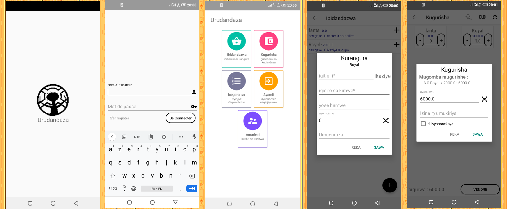

Application hors ligne permettant de gerer son propre boutique.

LES FONCTIONNALITES

* ajouter/modifier/supprimer les produits
* acheter les produits (par dettes même)
* modifier le prix/vendre/marquer comme perimée (ou cassé...) un produit
* voir l'historique modifier/supprimer les données dans une collection non-cloturée
* ajouter/modifier/supprimer les autres entrées et sorties non-liées au produits de la boutique (déplacements, impôts, loyer,...)
* gerer les dettes et les contacts y relatifs.

l'application demande comme permission special la lecture des comtacts pour les auto completer en cas d'une dette

